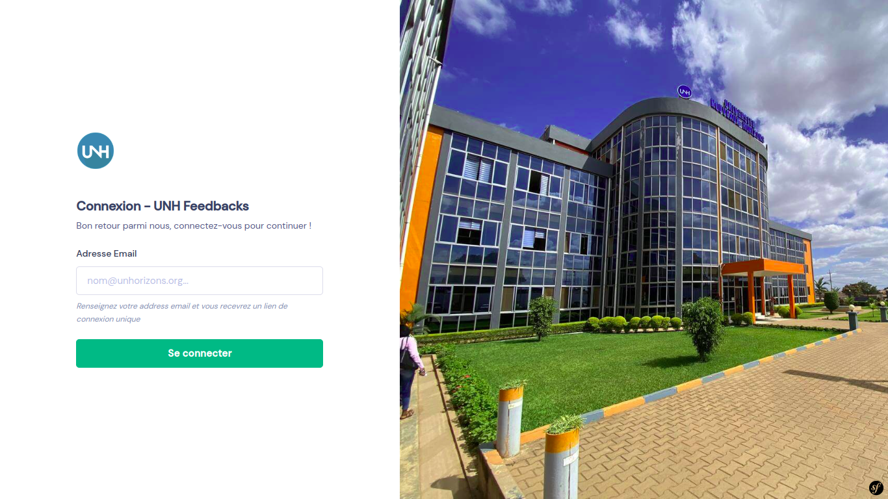
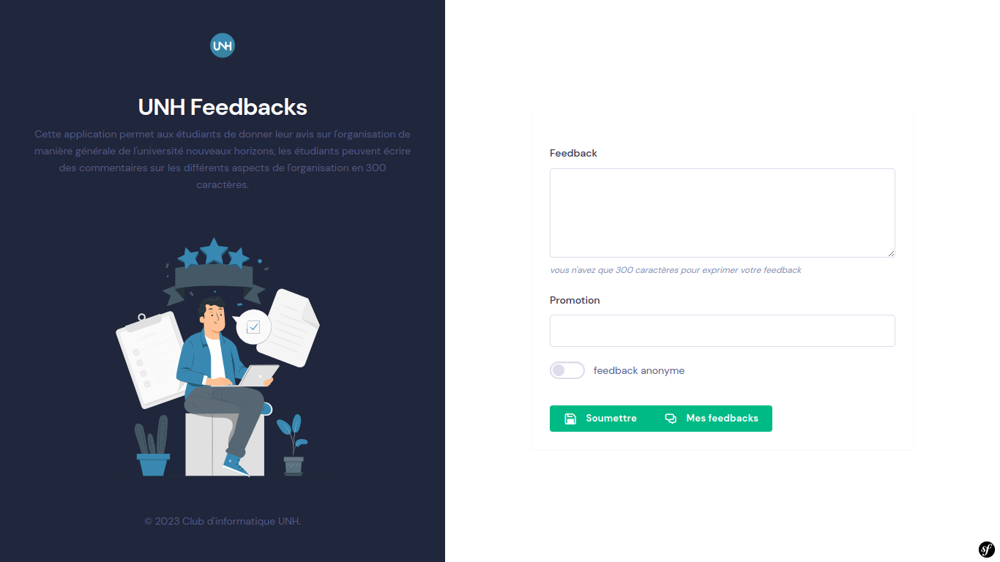
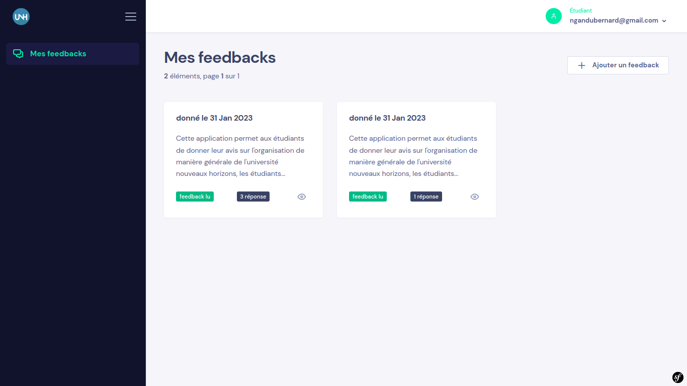
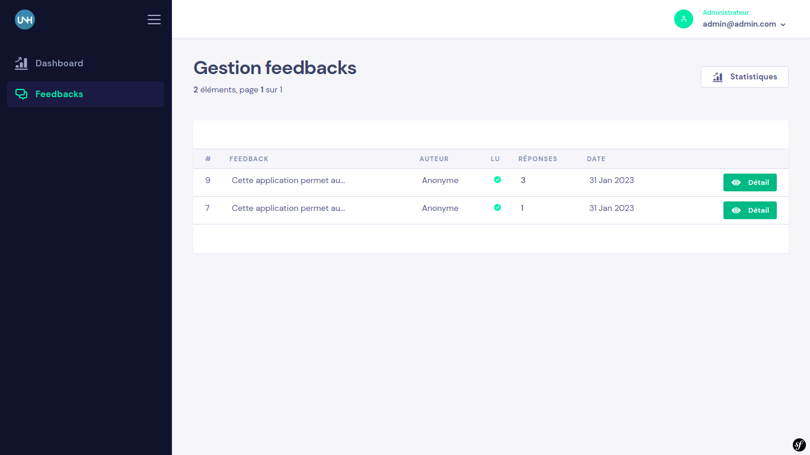
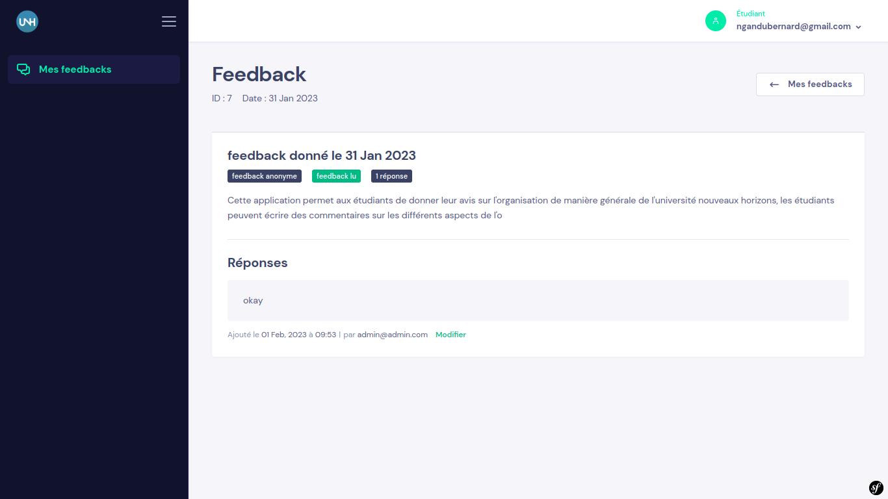

<p align="center">

</p>

# UNH Student Feedback

[](https://creativecommons.org/licenses/by/4.0/)
[](https://github.com/unhorizons/student-feedback/actions/workflows/lint.yaml)

L'application est conçue pour aider l'université à obtenir des commentaires et des avis des étudiants sur la gestion de l'université.

## Attributions des rôles

- Jerry Kashidi, Représentant des étudiants UNH (Initiateur du projet)
- Bernard Ngandu, président club info UNH (Chef de projet)

### Conditions requises

- [Docker](https://www.docker.com/) : Un conteneur est une unité logicielle standard qui regroupe le code et toutes ses dépendances, de sorte que l'application s'exécute rapidement et de manière fiable d'un environnement informatique à un autre.

## Installation et fonctionnement

```bash
git clone https://github.com/unhorizons/student-feedback feedback
cd feedback
```
Après avoir cloné le projet, vous devez installer les dépendances requises en exécutant la commande suivante dans le dossier du projet

Pour éviter les problèmes de permission avec docker, assurez-vous que les deux variables d'environnement suivantes sont définies sur votre machine
```bash
# dans .bashrc ou .zshrc 
export USER_ID=$(id -u)
export GROUP_ID=$(id -g)
```

you can also add an alias to facilitate command execution in the container

```bash
# dans .bashrc ou .zshrc
alias dr="USER_ID=$(id -u) GROUP_ID=$(id -g) docker-compose run --rm"

# exemples
# dr [service] command

dr php bin/console c:c
dr node yarn install
```

en suite
```bash
make install
```

Finalement vous pouvez lancer l'application avec 👇🏾.
```bash
make dev
```

## Comment contribuer

Les contributions sont encouragées et peuvent être soumises en "fork" de ce projet et en soumettant une demande de modification (pull request). Comme ce projet n'en est qu'à ses débuts, si votre modification est substantielle, veuillez d'abord soulever un problème (Issue) pour en discuter.

Nous avons également besoin de personnes pour tester les pull-requests. Jetez donc un coup d'œil sur [les problèmes ouverts](https://github.com/devscast/devscast.org/issues) et aidez-nous si vous le pouvez.

**pour plus d'info, lisez le [CONTRIBUTING.md](https://github.com/devscast/devscast.org/blob/master/CONTRIBUTING.md "CONTRIBUTING.md")**


### Code style et tests
Si vous constatez que l'une de vos pull reviews ne passe pas la vérification du serveur CI en raison d'un conflit de style de code, vous pouvez facilement le corriger en exécutant :

```bash
make lint 
make test
```

### contributors

<a href="https://github.com/unhorizons/student-feedback/graphs/contributors">
  
</a>

## Screenshots






